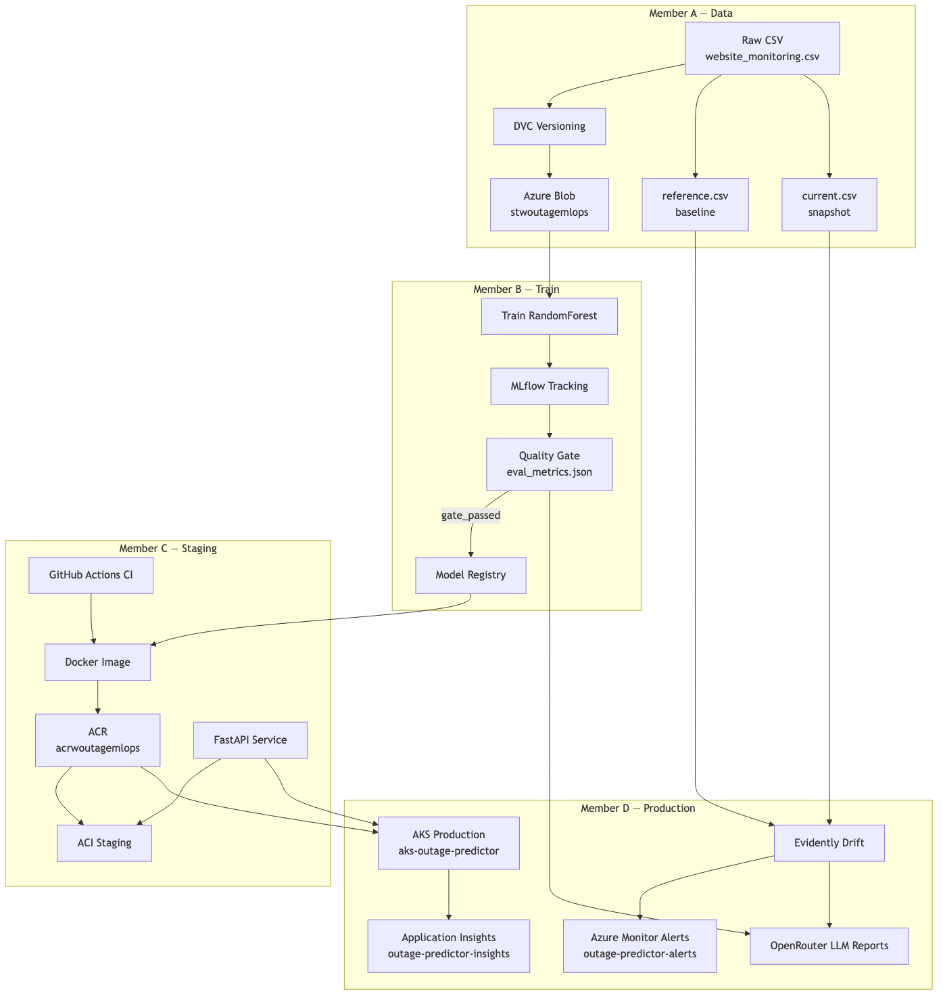
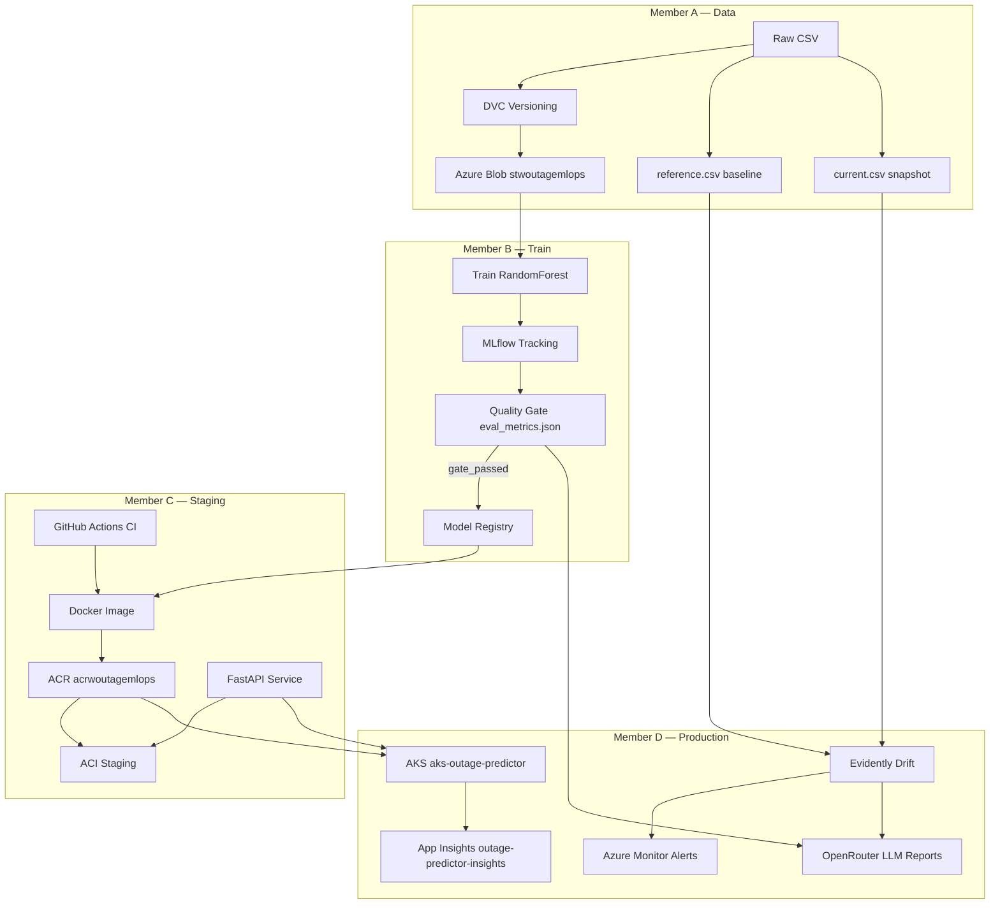
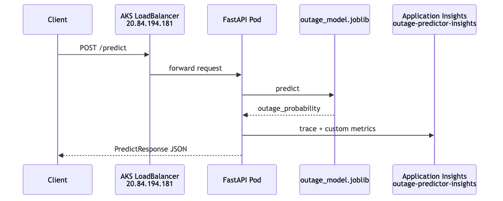
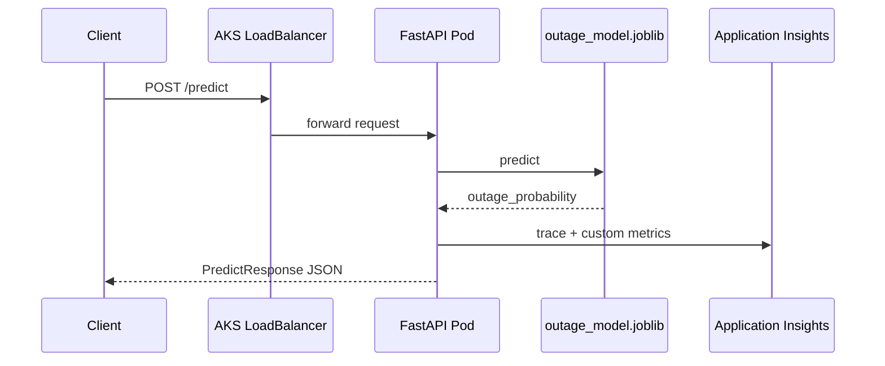
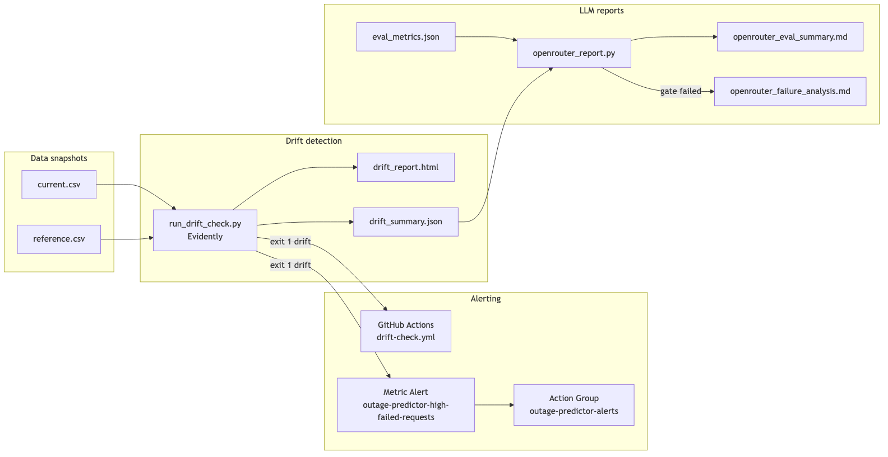
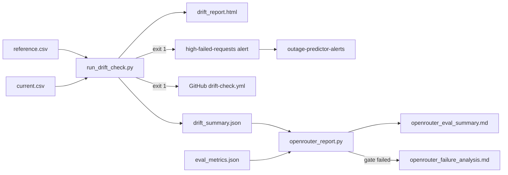
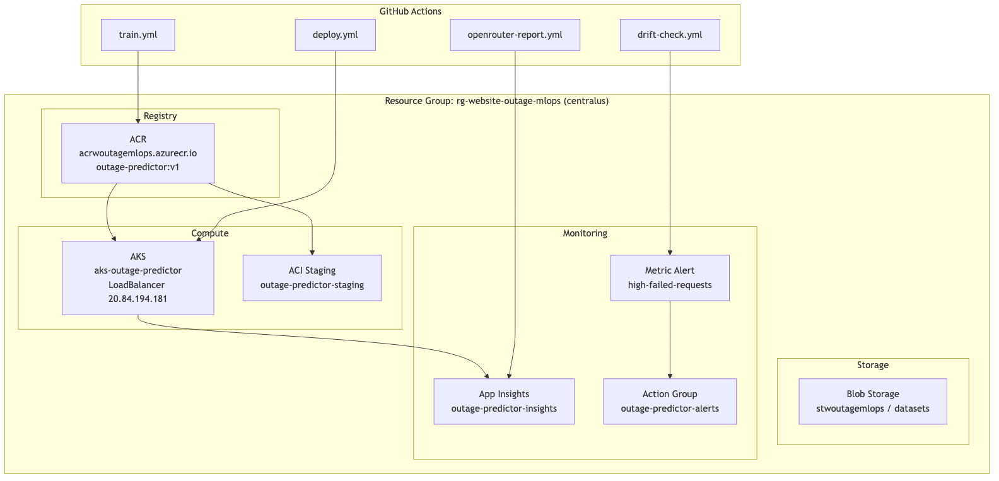

# Website Outage Prediction — Architecture

End-to-end MLOps pipeline on Azure (team of 4). Diagrams are maintained as Mermaid source (`.mmd`) and exported PNGs for slides.

## Render diagrams (demo slides)

```bash
python3.11 scripts/render_architecture_diagrams.py
```

Output: `docs/architecture/images/*.png`

Requires [mermaid-cli](https://github.com/mermaid-js/mermaid-cli) (`npm install -g @mermaid-js/mermaid-cli`) or `npx`.

## 1. End-to-end pipeline (all members)



Source: [01-end-to-end-pipeline.mmd](01-end-to-end-pipeline.mmd)



## 2. Production request flow (AKS)



Source: [02-production-request-flow.mmd](02-production-request-flow.mmd)

Live endpoint: `http://20.84.194.181/health`



## 3. Drift, alerting, and OpenRouter (Member D demo)



Source: [03-drift-alert-openrouter.mmd](03-drift-alert-openrouter.mmd)

**Demo moment:** Show `reports/drift/drift_report.html`, Azure alert / failed drift workflow, then `reports/openrouter/openrouter_eval_summary.md`.



## 4. Azure resource map (deployed)



Source: [04-azure-resources.mmd](04-azure-resources.mmd)

| Resource | Name | Purpose |
|----------|------|---------|
| Resource group | `rg-website-outage-mlops` | All team resources (centralus) |
| AKS | `aks-outage-predictor` | Production API |
| ACR | `acrwoutagemlops.azurecr.io` | Container images |
| App Insights | `outage-predictor-insights` | API telemetry |
| Action Group | `outage-predictor-alerts` | Email notifications |
| Metric alert | `outage-predictor-high-failed-requests` | Failed request spike |
| Blob | `stwoutagemlops` | DVC / datasets |

## Component map

| Stage | Owner | Key artifacts |
|-------|-------|---------------|
| 01 Data / DVC / Blob | Member A | `data/raw/`, `data/reference/reference.csv` |
| 02–04 Train / Gate / Registry | Member B | `models/outage_model.joblib`, `eval_metrics.json` |
| 05–08 Docker / API / CI / ACI | Member C | `Dockerfile`, `infra/deploy_aci.py` |
| 09–10 AKS / Monitor / Drift / LLM | Member D | `infra/deploy_aks.py`, `src/monitoring/`, `scripts/run_drift_check.py` |

## CI/CD workflows

| Workflow | Trigger | Purpose |
|----------|---------|---------|
| `train.yml` | Push to main / manual | Retrain → eval → register → build |
| `deploy.yml` | After train / manual | Deploy to AKS (gate check) |
| `drift-check.yml` | Schedule / manual | Evidently drift → alert on failure |
| `openrouter-report.yml` | After eval / manual | LLM eval + failure reports |

## Related docs

- [Stage 08 — Deployment](../stages/stage-08-deployment.md)
- [Stage 09 — Monitoring](../stages/stage-09-monitoring.md)
- [Stage 10 — OpenRouter](../stages/stage-10-openrouter.md)
- [Azure setup](../azure-setup.md)
- [Drift investigation findings](../drift-investigation-findings.md)
- [Demo day](../demo-day.md)
